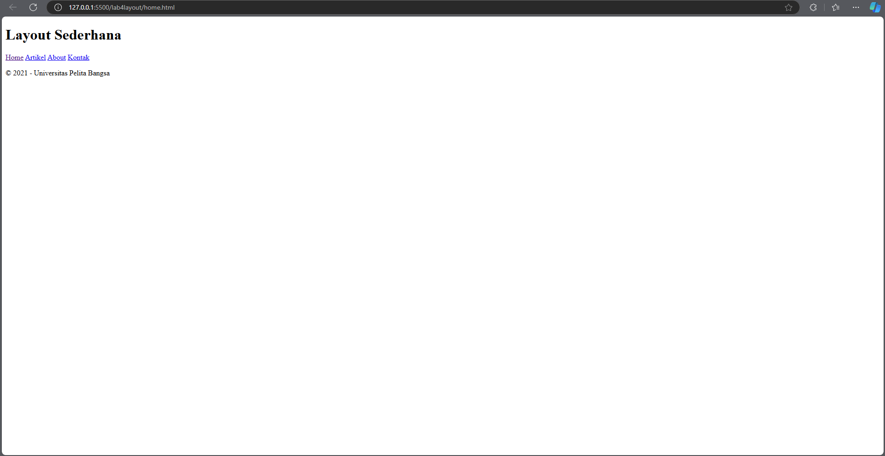
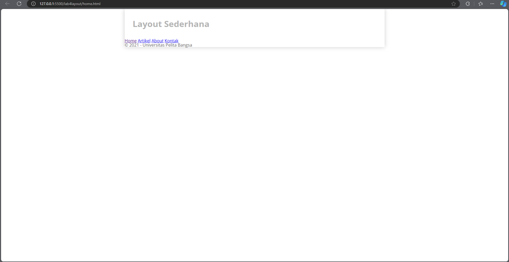
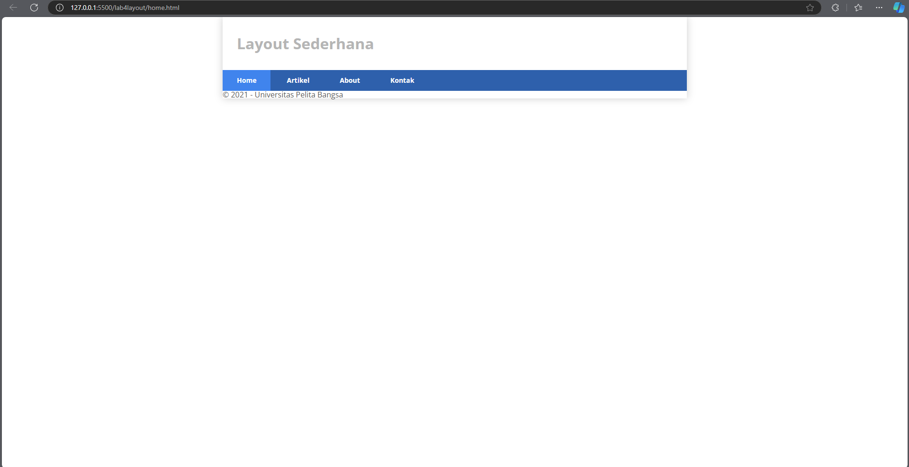
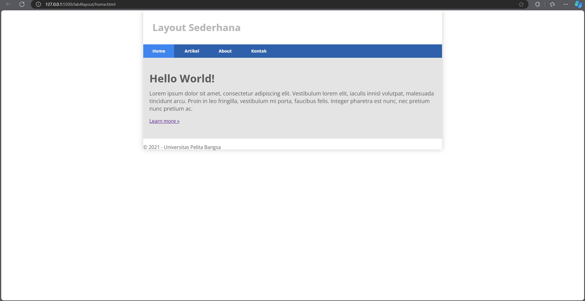
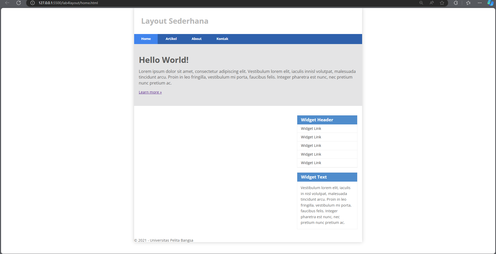
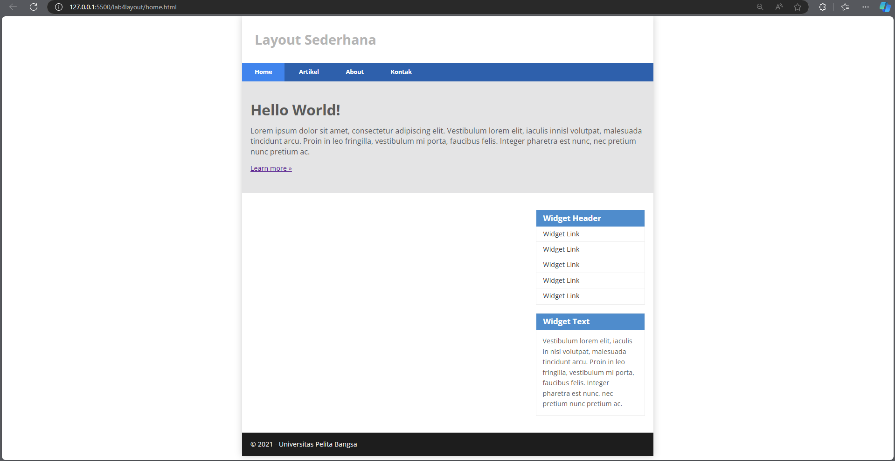
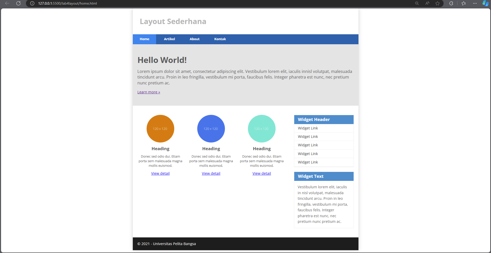
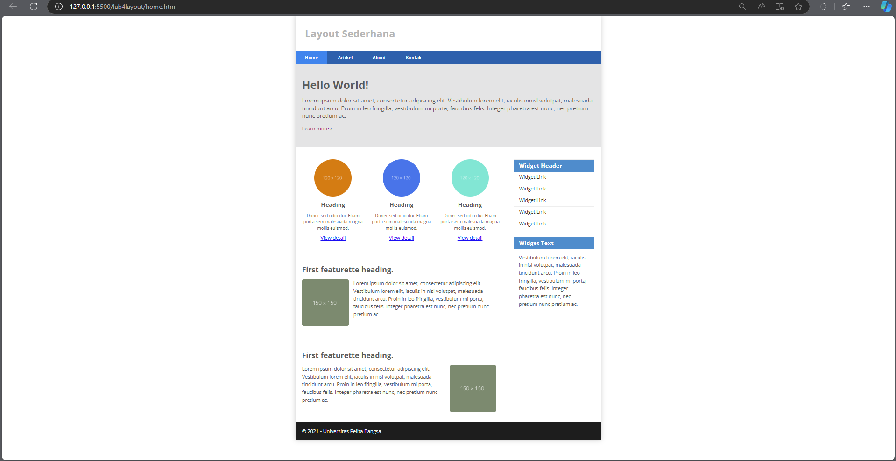

# Lab4Web
## Membuat layout sederhana
### Membuat dokumen HTML
```
<!DOCTYPE html>
<html lang="en">

<head>
    <meta charset="UTF-8">
    <meta name="viewport" content="width=device-width, initial-scale=1.0">
    <title>Layout Sederhana</title>
    <link rel="stylesheet" href="style.css">
</head>

<body>
    <div id="container">
    </div>
</body>

</html>
```
```
<header>
    <h1>Layout Sederhana</h1>
</header>
<nav>
    <a href="home.html" class="active">Home</a>
    <a href="artikel.html">Artikel</a>
    <a href="about.html">About</a>
    <a href="kontak.html">Kontak</a>
</nav>
<section id="hero"></section>
<section id="wrapper">
    <section id="main"></section>
    <aside id="sidebar"></aside>
</section>
<footer>
    <p>&copy; 2021 - Universitas Pelita Bangsa</p>
</footer>
```


### Menambahkan CSS
```
/* import google font */
@import url('https://fonts.googleapis.com/css2?family=Open+Sans:ital,wght@0,300;0,400;0,600;0,700;0,800;1,300;1,400;1,600;1,700;1,800&display=swap');
@import url('https://fonts.googleapis.com/css2?family=Open+Sans+Condensed:ital,wght@0,300;0,700;1,300&display=swap');

/* Reset CSS */
* {
    margin: 0;
    padding: 0;
}

body {
    line-height: 1;
    font-size: 100%;
    font-family: 'Open Sans', sans-serif;
    color: #5a5a5a;
}

#container {
    width: 980px;
    margin: 0 auto;
    box-shadow: 0 0 1em #cccccc;
}

/* header */
header {
    padding: 20px;
}

header h1 {
    margin: 20px 10px;
    color: #b5b5b5;
}
```


### Membuat navigasi
```
/* navigasi */
nav {
    display: block;
    background-color: #1f5faa;
}

nav a {
    padding: 15px 30px;
    display: inline-block;
    color: #ffffff;
    font-size: 14px;
    text-decoration: none;
    font-weight: bold;
}

nav a.active,
nav a:hover {
    background-color: #2b83ea;
}
```


### Membuat hero panel
```
<section id="hero">
    <h1>Hello World!</h1>
    <p>Lorem ipsum dolor sit amet, consectetur adipiscing elit. Vestibulum lorem
        elit, iaculis innisl volutpat, malesuada tincidunt arcu. Proin in leo fringilla,
        vestibulum mi porta, faucibus felis. Integer pharetra est nunc, nec pretium nunc
        pretium ac.</p>
    <a href="home.html" class="btn btn-large">Learn more &raquo;</a>
</section>
```
```
/* Hero Panel */
#hero {
    background-color: #e4e4e5;
    padding: 50px 20px;
    margin-bottom: 20px;
}

#hero h1 {
    margin-bottom: 20px;
    font-size: 35px;
}

#hero p {
    margin-bottom: 20px;
    font-size: 18px;
    line-height: 25px;
}
```


### Mengatur layout main dan sidebar
```
/* main content */
#wrapper {
    margin: 0;
}

#main {
    float: left;
    width: 640px;
    padding: 20px;
}

/* sidebar area */
#sidebar {
    float: left;
    width: 260px;
    padding: 20px;
}
```
Membuat sidebar widget
```
<aside id="sidebar">
    <div class="widget-box">
        <h3 class="title">Widget Header</h3>
        <ul>
            <li><a href="#">Widget Link</a></li>
            <li><a href="#">Widget Link</a></li>
            <li><a href="#">Widget Link</a></li>
            <li><a href="#">Widget Link</a></li>
            <li><a href="#">Widget Link</a></li>
        </ul>
    </div>
    <div class="widget-box">
        <h3 class="title">Widget Text</h3>
        <p>Vestibulum lorem elit, iaculis in nisl volutpat, malesuada tincidunt
            arcu. Proin in leo fringilla, vestibulum mi porta, faucibus felis. Integer
            pharetra est nunc, nec pretium nunc pretium ac.</p>
    </div>
</aside>
```
Kemudian tambahkan CSS
```
/* widget */
.widget-box {
    border: 1px solid #eee;
    margin-bottom: 20px;
}

.widget-box .title {
    padding: 10px 16px;
    background-color: #428bca;
    color: #fff;
}

.widget-box ul {
    list-style-type: none;
}

.widget-box li {
    border-bottom: 1px solid #eee;
}

.widget-box li a {
    padding: 10px 16px;
    color: #333;
    display: block;
    text-decoration: none;
}

.widget-box li:hover a {
    background-color: #eee;
}

.widget-box p {
    padding: 15px;
    line-height: 25px;
}
```


### Mengatur footer
```
/* footer */
footer {
    clear: both;
    background-color: #1d1d1d;
    padding: 20px;
    color: #eee;
}
```


### Menambahkan elemen lainnya pada main content
```
<section id="main">
    <div class="row">
        <div class="box">
            
            <h3>Heading</h3>
            <p>Donec sed odio dui. Etiam porta sem malesuada magna mollis
                euismod.</p>
            <a href="#" class="btn btn-default">View detail</a>
        </div>
        <div class="box">
            
            <h3>Heading</h3>
            <p>Donec sed odio dui. Etiam porta sem malesuada magna mollis
                euismod.</p>
            <a href="#" class="btn btn-default">View detail</a>
        </div>
        <div class="box">
            
            <h3>Heading</h3>
            <p>Donec sed odio dui. Etiam porta sem malesuada magna mollis
                euismod.</p>
            <a href="#" class="btn btn-default">View detail</a>
        </div>
    </div>
</section>
```
Kemudian tambahkan CSS
```
/* box */
.box {
    display: block;
    float: left;
    width: 33.333333%;
    box-sizing: border-box;
    -moz-box-sizing: border-box;
    -webkit-box-sizing: border-box;
    padding: 0 10px;
    text-align: center;
}

.box h3 {
    margin: 15px 0;
}

.box p {
    line-height: 20px;
    font-size: 14px;
    margin-bottom: 15px;
}

box img {
    border: 0;
    vertical-align: middle;
}

.image-circle {
    border-radius: 50%;
}

.row {
    margin: 0 -10px;
    box-sizing: border-box;
    -moz-box-sizing: border-box;
    -webkit-box-sizing: border-box;
}

.row:after,
.row:before,
.entry:after,
.entry:before {
    content: '';
    display: table;
}

.row:after,
.entry:after {
    clear: both;
}
```


### Menambahkan konten artikel
```
<hr class="divider" />
<article class="entry">
    <h2>First featurette heading.</h2>
    
    <p>Lorem ipsum dolor sit amet, consectetur adipiscing elit. Vestibulum lorem
        elit, iaculis in nisl volutpat, malesuada tincidunt arcu. Proin in leo fringilla,
        vestibulum mi porta, faucibus felis. Integer pharetra est nunc, nec pretium nunc
        pretium ac.</p>
</article>
<hr class="divider" />
<article class="entry">
    <h2>First featurette heading.</h2>
    
    <p>Lorem ipsum dolor sit amet, consectetur adipiscing elit. Vestibulum lorem
        elit, iaculis in nisl volutpat, malesuada tincidunt arcu. Proin in leo fringilla,
        vestibulum mi porta, faucibus felis. Integer pharetra est nunc, nec pretium nunc
        pretium ac.</p>
</article>
```
Kemudian tambahkan CSS
```
.divider {
    border: 0;
    border-top: 1px solid #eeeeee;
    margin: 40px 0;
}

/* entry */
.entry {
    margin: 15px 0;
}

.entry h2 {
    margin-bottom: 20px;
}

.entry p {
    line-height: 25px;
}

.entry img {
    float: left;
    border-radius: 5px;
    margin-right: 15px;
}

.entry .right-img {
    float: right;
}
```


### Tugas
1. Tambahkan layout untuk menu about
```
<!DOCTYPE html>
<html lang="en">

<head>
    <meta charset="UTF-8">
    <meta name="viewport" content="width=device-width, initial-scale=1.0">
    <title>About - Layout Sederhana</title>
    <link rel="stylesheet" href="style.css">
</head>

<body>
    <div id="container">
        <header>
            <h1>Layout Sederhana</h1>
        </header>
        <nav>
            <a href="home.html">Home</a>
            <a href="artikel.html">Artikel</a>
            <a href="about.html" class="active">About</a>
            <a href="kontak.html">Kontak</a>
        </nav>
        <section id="about-hero">
            <h1>About Me</h1>
            <p>Welcome to my portfolio page. Here you can find information about my skills, experience, and projects.</p>
        </section>
        <section id="wrapper">
            <section id="main">
                <article class="entry">
                    <h2>My Portfolio</h2>
                    <p>I am a web developer with expertise in HTML, CSS, and JavaScript. I have experience in creating responsive and user-friendly websites.</p>
                </article>
                <hr class="divider" />
                <article class="entry">
                    <h2>Skills</h2>
                    <ul>
                        <li>HTML5</li>
                        <li>CSS3</li>
                        <li>JavaScript</li>
                        <li>Responsive Web Design</li>
                        <li>UI/UX Design</li>
                    </ul>
                </article>
                <hr class="divider" />
                <article class="entry">
                    <h2>Projects</h2>
                    <div class="project">
                        
                        <h3>Project 1</h3>
                        <p>Description of Project 1</p>
                    </div>
                    <div class="project">
                        
                        <h3>Project 2</h3>
                        <p>Description of Project 2</p>
                    </div>
                </article>
            </section>
            <aside id="sidebar">
                <div class="widget-box">
                    <h3 class="title">Contact Information</h3>
                    <ul>
                        <li>Email: your.email@example.com</li>
                        <li>Phone: +1234567890</li>
                        <li>Location: Your City, Country</li>
                    </ul>
                </div>
                <div class="widget-box">
                    <h3 class="title">Social Media</h3>
                    <ul>
                        <li><a href="#">LinkedIn</a></li>
                        <li><a href="#">GitHub</a></li>
                        <li><a href="#">Twitter</a></li>
                    </ul>
                </div>
            </aside>
        </section>
        <footer>
            <p>&copy; 2023 - Your Name</p>
        </footer>
    </div>
</body>

</html>
```
CSS
```
#about-hero {
    background-color: #e4e4e5;
    padding : 20px;
    text-align: center;
}

#wrapper {
    display: flex;
    flex-wrap: wrap;
    justify-content: space-between;
}

#main {
    flex-basis: 70%;
}

#sidebar {
    flex-basis: 25%;
    padding: 20px;
    background-color: #f7f7f7;
    border: 1px solid #ddd;
}

.entry {
    margin-bottom: 20px;
}

.divider {
    border: 1px solid #ccc;
    margin: 20px 0;
}

.project {
    margin-bottom: 20px;
}

.project img {
    width: 100%;
    height: 150px;
    object-fit: cover;
    border-radius: 10px;
}

.widget-box {
    margin-bottom: 20px;
}

.widget-box .title {
    font-weight: bold;
    margin-bottom: 10px;
}
```
2. Tambahkan layout untuk menu kontak
```
<!DOCTYPE html>
<html lang="en">
<head>
    <meta charset="UTF-8">
    <meta name="viewport" content="width=device-width, initial-scale=1.0">
    <title>Contact - Layout Sederhana</title>
    <link rel="stylesheet" href="style.css">
</head>
<body>
    <div id="container">
        <header>
            <h1>Layout Sederhana</h1>
        </header>
        <nav>
            <a href="home.html">Home</a>
            <a href="artikel.html">Artikel</a>
            <a href="about.html">About</a>
            <a href="kontak.html" class="active">Kontak</a>
        </nav>
        <section id="contact-hero">
            <h1>Contact Us</h1>
            <p>Get in touch with us. We'd love to hear from you!</p>
        </section>
        <section id="wrapper">
            <section id="main">
                <div class="contact-form">
                    <h2>Send us a message</h2>
                    <form action="#" method="post">
                        <div class="form-group">
                            <label for="name">Name:</label>
                            <input type="text" id="name" name="name" required>
                        </div>
                        <div class="form-group">
                            <label for="email">Email:</label>
                            <input type="email" id="email" name="email" required>
                        </div>
                        <div class="form-group">
                            <label for="subject">Subject:</label>
                            <input type="text" id="subject" name="subject" required>
                        </div>
                        <div class="form-group">
                            <label for="message">Message:</label>
                            <textarea id="message" name="message" rows="5" required></textarea>
                        </div>
                        <button type="submit" class="submit-btn">Send Message</button>
                    </form>
                </div>
            </section>
            <aside id="sidebar">
                <div class="widget-box">
                    <h3 class="title">Contact Information</h3>
                    <ul>
                        <li>Email: info@example.com</li>
                        <li>Phone: +1234567890</li>
                        <li>Address: 123 Street Name, City, Country</li>
                    </ul>
                </div>
                <div class="widget-box">
                    <h3 class="title">Business Hours</h3>
                    <ul>
                        <li>Monday - Friday: 9am - 5pm</li>
                        <li>Saturday: 10am - 2pm</li>
                        <li>Sunday: Closed</li>
                    </ul>
                </div>
            </aside>
        </section>
        <footer>
            <p>&copy; 2023 - Your Company Name</p>
        </footer>
    </div>
</body>
</html>
```
CSS
```
#contact-hero {
    background-color: #e4e4e5;
    padding: 20px;
    text-align: center;
}

#wrapper {
    display: flex;
    flex-wrap: wrap;
    justify-content: space-between;
}

#main {
    flex-basis: 65%;
}

#sidebar {
    flex-basis: 30%;
}

.contact-form {
    background-color: #f9f9f9;
    padding: 20px;
    border-radius: 5px;
}

.form-group {
    margin-bottom: 20px;
}

label {
    display: block;
    margin-bottom: 10px;
}

input[type="text"], input[type="email"], textarea {
    width: 100%;
    padding: 10px;
    border: 1px solid #ccc;
    border-radius: 5px;
}

.submit-btn {
    background-color: #4CAF50;
    color: #fff;
    padding: 10px 20px;
    border: none;
    border-radius: 5px;
    cursor: pointer;
}

.submit-btn:hover {
    background-color: #3e8e41;
}
```